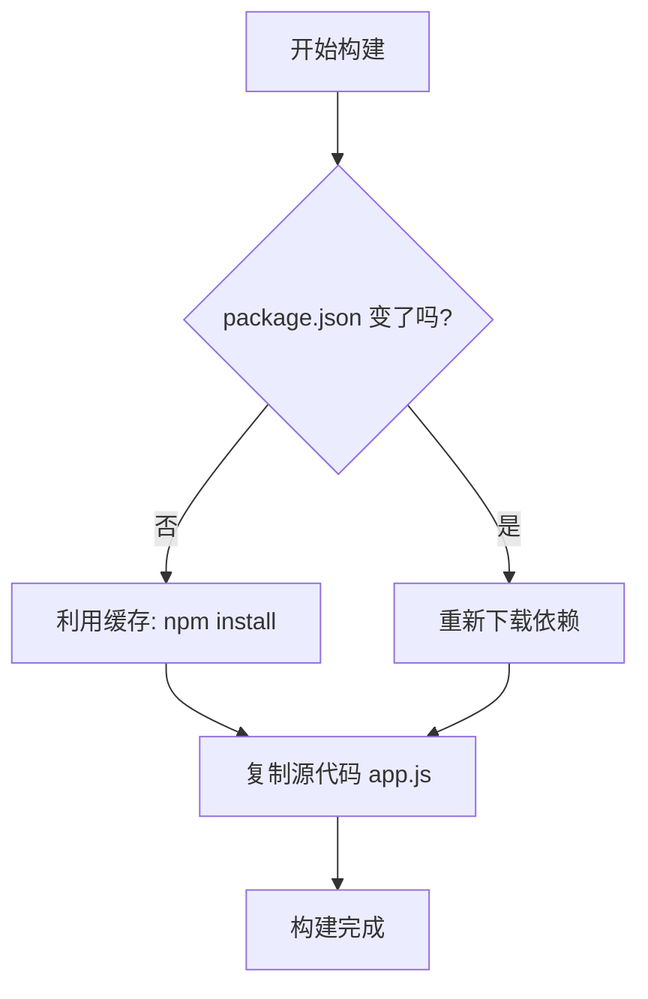

## 0. 目标

构建一个 Node.js 镜像看似简单，但要做到**生产可用**，必须解决以下三个痛点：

1. **构建速度慢**：每次修改代码都要重新下载 `node_modules`。
2. **镜像体积大**：官方镜像动辄 1GB，传输和部署缓慢。
3. **安全隐患**：默认使用 root 权限，且将 `node_modules` 里的垃圾文件带入生产环境。

本篇笔记将通过一个 Express 项目，演示从能跑就行到生产交付的进化过程。

---

## 1. 环境准备

假设我们有一个最基础的 Web 项目，目录结构如下：

```text
my-node-app/
├── package.json
├── package-lock.json
└── app.js
```

**app.js (业务代码)**：

```javascript
const express = require('express');
const app = express();

app.get('/', (req, res) => res.send('Hello Docker World!'));

app.listen(3000, () => console.log('Server running on port 3000'));
```

---

## 2. 反面教材

这是新手最容易写的 Dockerfile，虽然能运行，但**极不推荐**。

**Dockerfile.bad**：

```dockerfile
# 问题1：使用 latest 标签，版本不可控；且基础镜像过大 (Debian版约900MB)
FROM node:latest

WORKDIR /app

# 问题2：先复制所有文件，再安装依赖
# 只要改了一行代码，Docker 就认为这层变了，导致后面的 npm install 缓存失效
# 每次构建都要重新下载几百 MB 的依赖
COPY . .
RUN npm install

# 问题3：默认以 root 运行，有安全风险
CMD ["node", "app.js"]
```

---

## 3. 进阶优化

通过调整指令顺序和使用轻量级基础镜像，解决体积和速度问题。

**关键策略**：将 `package.json` 的复制与源代码的复制分开。



**Dockerfile.better**：

```dockerfile
# 优化1：锁定具体版本，并使用 slim (Debian精简版) 或 alpine
FROM node:18-alpine

WORKDIR /app

# 优化2：独立复制依赖描述文件
COPY package.json package-lock.json ./

# 优化3：安装依赖
# --frozen-lockfile: 确保完全按照 lock 文件安装，不自动升级
RUN npm ci --only=production

# 优化4：最后复制源代码
# 这样修改代码时，上面几层都会命中缓存，构建速度极快
COPY . .

EXPOSE 3000
CMD ["node", "app.js"]
```

---

## 4. 最佳实践

在进阶版的基础上，加入权限控制、环境配置和构建过滤，达到交付标准。

### 第一步：配置 .dockerignore

这步至关重要，防止本地庞大的 `node_modules` 被复制进去覆盖了镜像里安装好的依赖。

**.dockerignore**：

```text
node_modules
npm-debug.log
Dockerfile
.git
.env
```

### 第二步：编写最终版 Dockerfile

整合了用户切换、环境变量配置和进程管理信号处理。

```dockerfile
# 1. 选择轻量基础镜像
FROM node:18-alpine

# 2. 设置环境变量 (生产模式下 npm install 会自动跳过 devDependencies)
ENV NODE_ENV=production

# 3. 设置工作目录
WORKDIR /app

# 4. 权限预处理：将工作目录归属给 node 用户
# node 镜像是官方内置的非 root 用户
RUN chown -R node:node /app

# 5. 切换用户 (后续所有命令都以普通用户执行)
USER node

# 6. 复制依赖文件
COPY --chown=node:node package*.json ./

# 7. 安装生产依赖
RUN npm ci && npm cache clean --force

# 8. 复制源代码 (注意权限)
COPY --chown=node:node . .

# 9. 暴露端口
EXPOSE 3000

# 10. 启动命令
# 使用数组格式，确保 node 进程能接收到 SIGTERM 信号(优雅退出)
CMD ["node", "app.js"]
```

---

## 5. 构建与验证

使用以下命令进行实战操作。

### 构建镜像

```bash
# -t 指定名称和标签
# 注意最后的点 (.) 代表上下文路径
docker build -t my-express-app:v1 .
```

### 启动容器

```bash
# --init: 使用 tini 作为 PID 1 进程，解决 Node.js 僵尸进程问题
# -p: 端口映射
# --read-only: (可选) 文件系统只读，提高安全性
docker run -d \
  --name express-web \
  --init \
  -p 8080:3000 \
  my-express-app:v1
```

### 验证效果

1. **访问**：浏览器打开 `http://localhost:8080`，看到 "Hello Docker World!"。
2. **查看用户**：

	```bash
    docker exec express-web whoami
    # 输出: node (说明已成功切换为非 root 用户)
    ```

3. **测试缓存**：
	修改 `app.js` 中的文字，再次执行 `docker build`。你会发现 `npm install` 那一步瞬间完成（Using cache），只有最后一步 `COPY . .` 重新执行了。

---

## 6. 常见问题排查

| 现象                        | 原因                  | 解决方案                                             |
| :------------------------ | :------------------ | :----------------------------------------------- |
| 构建极慢，发送上下文几百兆             | 未配置 `.dockerignore` | 在项目根目录添加 `.dockerignore` 排除 `node_modules`       |
| EACCES: permission denied | 切换用户后没权限写文件         | 在 `COPY` 时加上 `--chown=node:node`                 |
| 容器无法通过 Ctrl+C 停止          | `CMD` 使用了字符串格式      | `CMD` 改用数组格式 `["node", "app.js"]` 或加 `--init` 参数 |
| Alpine 中 bcrypt 报错        | 缺少 Python/Make 编译环境 | 换回 `node:18-slim` 或在 Alpine 中手动安装 `build-base`   |
