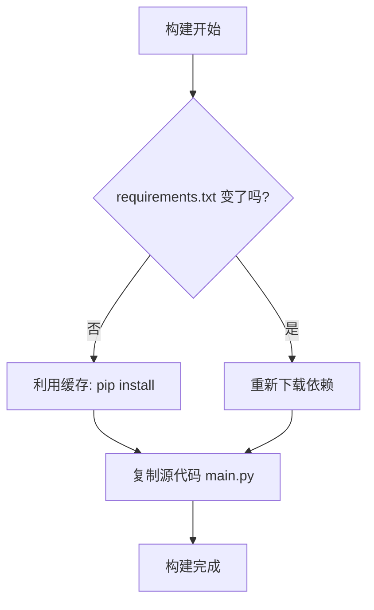

## 0. 痛点

构建 Python 镜像时，开发者经常面临三大问题：

1. **构建龟速**：每次改代码，`pip install` 都要重跑一遍，尤其是 `numpy` 或 `pandas` 这种大库。
2. **日志延迟**：容器启动了，但 `docker logs` 迟迟看不到 Python 的打印输出（缓冲问题）。
3. **体积膨胀**：简单的脚本打包完竟然有 1GB，且包含大量 `.pyc` 垃圾文件。

本篇笔记将以一个 Flask 项目为例，演示从能跑到生产级的过程。

---

## 1. 环境准备

假设项目目录结构如下：

```text
my-python-app/
├── main.py
└── requirements.txt
```

**main.py (业务代码)**：

```python
import os
from flask import Flask

app = Flask(__name__)

@app.route('/')
def hello():
    return f"Hello from {os.environ.get('HOSTNAME')}!"

if __name__ == '__main__':
    # 注意：Host 必须设为 0.0.0.0，否则外部无法访问
    app.run(host='0.0.0.0', port=5000)
```

**requirements.txt**:

```text
Flask==2.2.3
gunicorn==20.1.0
```

---

## 2. 反面教材

这是最直觉的写法，但它破坏了 Docker 的分层缓存机制。

**Dockerfile.bad**:

```dockerfile
# 问题1：基础镜像过大
FROM python:3.10

WORKDIR /app

# 问题2：代码一变，这层缓存失效，导致 pip install 必须重跑
COPY . .
RUN pip install -r requirements.txt

# 问题3：未设置环境变量，日志会被 Python 缓存，无法实时看到
CMD ["python", "main.py"]
```

---

## 3. 进阶优化

利用分层机制加速构建，并配置 Python 特有的环境变量。

**关键变量解析**：
- `PYTHONDONTWRITEBYTECODE=1`: 禁止生成 `__pycache__` (.pyc) 文件。容器是只读的，这些缓存文件毫无意义，只会增加体积。
- `PYTHONUNBUFFERED=1`: **非常重要**。关闭标准输出缓冲，确保 `print()` 的日志能立即通过 `docker logs` 看到，而不是等缓冲区满了才吐出来。



**Dockerfile.better**:

```dockerfile
# 优化1：使用 Slim 版本 (基于 Debian，兼容性好且体积小)
FROM python:3.10-slim

WORKDIR /app

# 优化2：设置 Python 专属环境变量
ENV PYTHONDONTWRITEBYTECODE=1 \
    PYTHONUNBUFFERED=1

# 优化3：利用缓存机制
# 先只拷贝依赖文件
COPY requirements.txt .
# 安装依赖，并增加 --no-cache-dir 减少镜像体积
RUN pip install --no-cache-dir -r requirements.txt

# 优化4：最后拷贝代码
COPY . .

CMD ["python", "main.py"]
```

---

## 4. 生产级最佳实践

在进阶版基础上，加入**非 Root 用户**和**生产级 WSGI 服务器**配置。

### 第一步：配置 .dockerignore

永远不要把本地环境带入容器，这会导致奇怪的兼容性问题。

**.dockerignore**:

```text
__pycache__
*.pyc
*.pyo
venv/
.git
.env
Dockerfile
```

### 第二步：编写最终版 Dockerfile

```dockerfile
# 1. 基础镜像
FROM python:3.10-slim

# 2. 环境变量
ENV PYTHONDONTWRITEBYTECODE=1 \
    PYTHONUNBUFFERED=1

# 3. 工作目录
WORKDIR /app

# 4. 创建非 root 用户 (安全原则)
# -r: 系统用户, -u 1001: 指定 UID
RUN groupadd -g 1001 appuser && \
    useradd -r -u 1001 -g appuser appuser

# 5. 安装依赖
COPY requirements.txt .
RUN pip install --no-cache-dir -r requirements.txt

# 6. 拷贝代码并修改权限
# 必须在拷贝时归属给新用户，否则切用户后无法读取
COPY --chown=appuser:appuser . .

# 7. 切换用户
USER appuser

# 8. 暴露端口
EXPOSE 5000

# 9. 启动命令
# 生产环境不建议直接用 python main.py，推荐使用 gunicorn
# --bind: 绑定地址
# --workers: 进程数
# --access-logfile -: 日志输出到标准输出(stdout)
CMD ["gunicorn", "--bind", "0.0.0.0:5000", "--workers", "3", "--access-logfile", "-", "main:app"]
```

---

## 5. Alpine vs Slim

在 Python 世界里，这是最大的争论点。

| 特性 | Python Slim (推荐) | Python Alpine (慎用) |
| :--- | :--- | :--- |
| **系统底层** | Debian | Alpine Linux (Musl Libc) |
| **C 扩展支持** | **完美** (支持 manylinux wheel) | **差** (需本地编译) |
| **构建速度** | 快 (pip install 直接下载二进制) | 慢 (可能需要编译几十分钟) |
| **体积** | ~120MB | ~50MB |
| **适用场景** | 数据科学、Web 通用、含 C 依赖 | 纯 Python 脚本、极简微服务 |

>如果需要安装 `numpy`, `pandas`, `psycopg2` (PostgreSQL), `pillow` (图片处理) 等库，**无脑选择 Slim**。因为这些库的预编译包（Wheel）大多是基于 glibc 的，在 Alpine (musl) 上无法运行，pip 会尝试下载源码在本地编译，你需要安装 gcc、g++ 等一大堆构建工具，最终做出来的镜像可能比 Slim 还大，且构建极慢。

---

## 6. 多阶段构建 (针对编译型依赖)

如果确实需要极致瘦身，或者必须在镜像里编译某些特殊的 C 库，可以使用多阶段构建。

```dockerfile
# --- 阶段一：构建者 (包含 gcc 等全套工具) ---
FROM python:3.10-slim AS builder

WORKDIR /app
COPY requirements.txt .

# 安装编译工具
RUN apt-get update && apt-get install -y --no-install-recommends gcc build-essential

# 安装依赖到指定目录 (/install)
RUN pip install --no-cache-dir --prefix=/install -r requirements.txt

# --- 阶段二：运行者 (纯净环境) ---
FROM python:3.10-slim

WORKDIR /app

# 从 builder 阶段把安装好的包带过来
COPY --from=builder /install /usr/local

COPY . .

CMD ["python", "main.py"]
```
