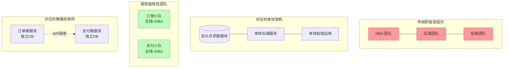

## 0. 定义

康威定律由 Melvin Conway 于 1967 年提出，它是软件架构领域的 " 第一性原理 "。其核心论断是：**组织形式决定系统架构**。

$$
\text{System Architecture} \cong \text{Communication Structure}
$$

- **原文**：" 设计系统的组织，其产生的设计等同于组织之内、之间的沟通结构。"
- **白话**：如果团队是按 " 前端组 " 和 " 后端组 " 划分的，那么做出来的软件一定会有复杂的前后端接口和高昂的联调成本；如果团队是按 " 业务领域 " 划分的，软件就会长成一个个独立的微服务。

---

## 1. 映射关系

软件的模块边界，本质上是人与人之间的**沟通边界**：



---

## 2. 逆康威定律 (Inverse Conway Maneuver)

既然架构无法违背组织结构，那么想要什么样的架构，就必须先建立什么样的组织。这被称为 " 逆康威演练 "。

- **错误做法**：保持只有 " 开发部 " 和 " 运维部 " 的层级结构，却强行推行 DevOps 和微服务。
	- *后果*：开发把代码扔过墙给运维，微服务变成分布式的单体，运维被报警淹没。
- **正确做法**：调整组织架构。
	- *动作*：拆散职能部门，组建 "Two-pizza Team"（亚马逊的双披萨团队，约 8-10 人）。每个团队包含开发、测试、产品和运维角色，对一个微服务的全生命周期负责。

---

## 3. 代码结构的投影

康威定律不仅影响服务架构，甚至渗透到代码库的文件目录结构中。

**场景**：开发一个包含用户和订单功能的电商系统。

### 职能型团队的代码 (Siloed)

沟通成本高，改一个功能需要跨三个文件夹，涉及三拨人。

```text
src/
├── controllers/  (后端组负责)
│   ├── UserController.java
│   └── OrderController.java
├── services/     (后端核心组负责)
│   ├── UserService.java
│   └── OrderService.java
└── views/        (前端组负责)
    ├── user.html
    └── order.html
```

### 领域型团队的代码 (Domain Driven)

高内聚，一个团队维护一个目录，沟通闭环。

```text
src/
├── user-context/ (用户小队负责)
│   ├── UserController.java
│   ├── UserService.java
│   └── user.html
└── order-context/ (订单小队负责)
    ├── OrderController.java
    ├── OrderService.java
    └── order.html
```

---

## 4. 警示

1. **编译器案例**：如果你让 3 个小组去设计一个编译器，你最终会得到一个 3 遍扫描的编译器。
2. **API 接口地狱**：当两个模块由两个沟通不畅的团队负责时，这两个模块之间的 API 接口会变得异常复杂且文档化极重，作为缺乏沟通的防御机制。
3. **认知负荷**：单个团队的人数不应超过邓巴数（通常限制在 10 人以内）。一旦团队过大，沟通复杂度呈指数上升，导致系统架构变得臃肿不清。
