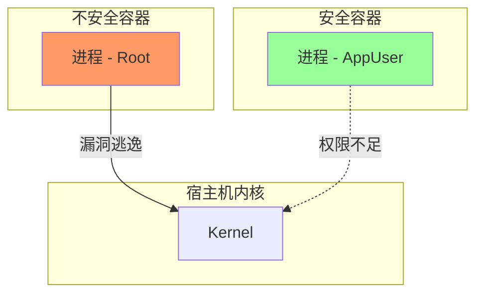

## 0. 风险

默认情况下，Docker 容器内的进程是以 **root 用户 (UID 0)** 身份运行的。

这是一个巨大的安全隐患。因为容器共享宿主机的内核，如果黑客利用应用程序的漏洞（如 RCE 代码执行漏洞）攻破了容器，且容器进程是 root 权限，攻击者就更容易**逃逸**到宿主机，获取整个服务器的控制权。

**原则核心**：只给予应用运行所需的**最小**权限，多一点都不行。



---

## 1. 禁用 Root 身份

这是最基础也最重要的加固手段。在 Dockerfile 构建阶段，显式创建普通用户并切换。

**场景**：构建一个 Node.js 应用。官方 Node 镜像通常内置了一个名为 `node` 的用户，但默认不启用。

### 错误做法

```dockerfile
FROM node:18
WORKDIR /app
COPY . .
CMD ["node", "app.js"]
# 结果：应用以 root 身份运行，不仅能随意修改容器内文件，还增加了逃逸风险。
```

### 正确做法

务必注意文件权限问题：在切换用户前，确保该用户对工作目录有读写权限。

```dockerfile
FROM node:18-alpine

WORKDIR /app

# 1. 创建专用用户 (如果是 Alpine，用 addgroup/adduser)
# 注意：许多官方镜像(如 node, python) 已经内置了非 root 用户，可直接用
# RUN addgroup -S myuser && adduser -S myuser -G myuser

# 2. 修改文件权限 (将 /app 的所有权交给 node 用户)
# 如果不加这一步，切换用户后可能无法写入日志或临时文件
COPY --chown=node:node . .

# 3. 切换身份
USER node

# 4. 启动应用
CMD ["node", "app.js"]
```

---

## 2. 限制内核能力

Linux 内核将 root 的超级权限被分割成了许多小的能力切片。

Docker 默认开启了一些基础能力（如 `CHOWN`, `NET_RAW`），但对于普通的 Web 应用来说，这些可能都是多余的。

**最佳实践**：采用白名单模式——**先关掉所有能力，再按需开启**。

| Capability | 作用 | 风险 | 是否需要 |
| :--- | :--- | :--- | :--- |
| `NET_ADMIN` | 网络配置 | 可篡改防火墙/拦截流量 | 仅 VPN 类应用需要 |
| `SYS_ADMIN` | 系统管理 | **极高危** (类似完整 Root) | 绝大多数应用都不需要 |
| `NET_BIND_SERVICE` | 绑定低位端口 | 绑定 < 1024 端口 | Web 服务通常需要 |
| `CHOWN` | 修改文件主 | 可被利用提权 | 仅安装脚本需要 |

**操作命令**：

```bash
# 激进模式：丢弃所有能力 (drop all)，应用极其安全
docker run --cap-drop=ALL my-app

# 均衡模式：丢弃所有，仅允许绑定 80 端口
docker run --cap-drop=ALL --cap-add=NET_BIND_SERVICE nginx
```

---

## 3. 文件系统只读

如果应用被攻破，黑客通常会尝试下载恶意脚本或修改配置文件。

通过将容器根文件系统设置为**只读**，可以从物理层面阻断这种攻击。

**场景**：运行一个静态网站或无状态的微服务。

```bash
# --read-only: 整个容器文件系统不可写
docker run -d --read-only nginx
```

**解决应用报错**：应用运行时通常需要写临时文件（如 `/tmp`）或日志（如 `/var/log`）。一旦开启只读模式，应用会报错崩溃。

**解决方案**：使用 `tmpfs`（内存文件系统）挂载可写区域。

```bash
# 根目录只读，但给 /tmp 分配一个临时内存写入区
docker run -d \
  --read-only \
  --tmpfs /tmp \
  --tmpfs /run \
  my-app
```

---

## 4. 资源限制

最小权限不仅指 " 操作权 "，也指 " 资源使用权 "。

不加限制的容器可能会因为程序 Bug 或恶意攻击吃光宿主机的 CPU 和内存，导致宿主机死机。

**场景**：防止某个 Java 容器发生内存泄漏拖垮整个服务器。

```bash
# 限制最多使用 0.5 个 CPU 核心和 512MB 内存
docker run -d \
  --cpus="0.5" \
  --memory="512m" \
  --memory-swap="512m" \
  java-app
```

---

## 5. 端口映射最小化

不要习惯性地使用 `-P` 将所有端口暴露出去，除非必须也不要监听 `0.0.0.0`。

**场景**：你的数据库只需要被同一台机器上的 Web 容器访问，不需要暴露给外网。

```bash
# 错误：将 3306 暴露给全网
docker run -p 3306:3306 mysql

# 正确：仅监听本地环回地址 (限制外网访问)
docker run -p 127.0.0.1:3306:3306 mysql

# 最佳：根本不映射端口，通过 Docker Network 内部通信
# 创建专用网络，容器间通过名字访问，外部彻底无法触达
docker network create private-net
docker run --network private-net --name db mysql
docker run --network private-net --name web my-web-app
```
