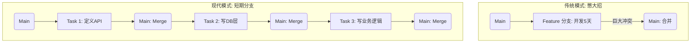

## 0. 核心定义

**短期分支** (Short-lived Branches) 是现代持续集成 (CI) 的核心支柱。原则要求任何开发分支的生命周期（从创建到合并）应尽可能短，通常**不超过 24-48 小时**。

- **目标**：将集成风险均摊到每一天，而不是累积到最后。
- **口号**：Merge Early, Merge Often（早合并，常合并）。

---

## 1. 痛点场景：合并地狱

开发者 A 领了一个任务 " 重构用户模块 "，预计耗时 2 周。

- **Day 1-13**：A 在 `feature/user-refactor` 分支上狂写代码，修改了 50 个文件。期间，团队其他成员向 `main` 合并了 40 次提交，其中包含对用户表的结构调整。
- **Day 14**：A 准备合并。
- **结果**：Git 报出 200+ 个冲突。A 花了整整 2 天解冲突，且因为逻辑覆盖，不小心把同事修好的 Bug 又改回去了（Regression）。

$$
 \text{合并痛苦指数} \propto (\text{分支时间})^2 
$$

---

## 2. 实施策略：原子化拆解

要实现短期分支，必须掌握将**大需求 (Feature)** 拆解为**小任务 (Task)** 的能力。

**任务目标**：开发一个完整的 " 用户评论系统 "。

**错误做法**：一个分支写完 Controller, Service, Dao, UI，耗时 5 天，一次提交。

**正确做法**：

| 步骤 | 分支名 (寿命) | 提交内容 | 安全性保障 |
| :--- | :--- | :--- | :--- |
| **Day 1 上午** | `feat/comment-api` (4h) | 定义接口入参出参，写好空的 Service 方法。 | 代码未被调用，不影响线上。 |
| **Day 1 下午** | `feat/comment-db` (3h) | 创建数据库表 migration 脚本，写好 DAO 层。 | 新表独立存在，无副作用。 |
| **Day 2 上午** | `feat/comment-logic` (6h) | 实现 Service 核心逻辑，**加单元测试**。 | 逻辑有测试保护，且入口未开放。 |
| **Day 2 下午** | `feat/comment-ui` (5h) | 写前端页面，对接 API，**开启特性开关**。 | 通过开关隐藏入口。 |

---

## 3. 代码演示：抽象先行

如何提交 " 没写完 " 的代码而不破坏构建？使用 **桩代码 (Stub)** 和 **接口抽象**。

**第一次提交合并入主干**：只有骨架，逻辑是空的，但能编译通过。

```java
// UserCommentService.java
public class UserCommentService {
    
    // 方法定义好了，但暂时只返回空列表
    // 这样前端就可以并行开发 UI 了，不用等后端写完逻辑
    public List<Comment> getComments(String postId) {
        // TODO: Implement database logic in next PR
        return Collections.emptyList();
    }

    public void addComment(String content) {
        // 暂时不做任何事，或者抛出 "Not Implemented"
        // 保证调用链路是通的
        System.out.println("Stub: Comment added - " + content);
    }
}
```

---

## 4. 视觉化对比



---

## 5. Checklist

为了确保短期分支策略有效执行，团队需遵守以下红线：

1. **行数限制**：一个 PR (Pull Request) 的改动最好控制在 **200-400 行**以内。超过这个数，Code Review 的质量会直线下降。
2. **构建变绿**：任何分支合并前，必须通过自动化测试（CI）。
3. **不依赖 UI**：后端逻辑写完就测单元测试，不要等到前端做完才合并。
4. **特性开关兜底**：如果功能逻辑未完成，必须用 Feature Toggle 包裹，确保只有开发者自己能触发。

---

## 6. 收益总结

- **更快的反馈**：同事能立刻看到你的代码，及早发现架构设计问题。
- **心理负担小**：合并 10 行代码的冲突，比合并 1000 行要轻松得多。
- **流水线畅通**：避免了 " 因为一个大功能的 Bug 导致整个发布被阻塞 " 的情况。
