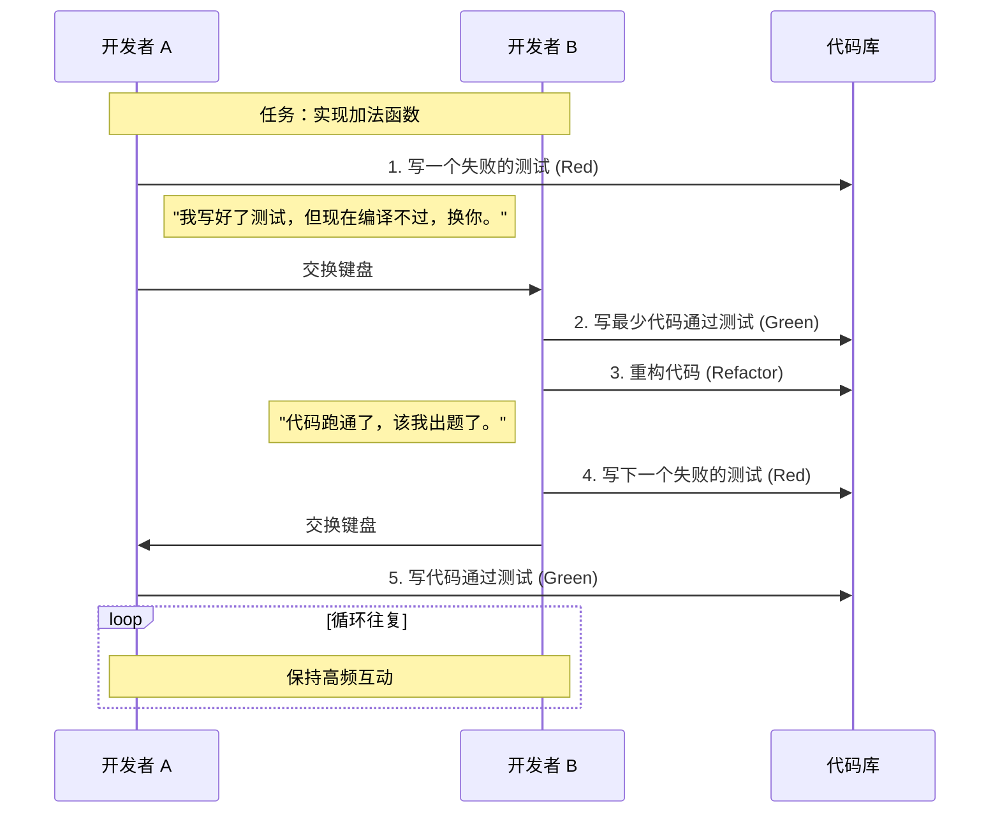

## 0. 定义

结对编程是 **实时代码审查** 与 **即时知识共享** 的结合。

最精准的隐喻是 **拉力赛车 (Rally Racing)**：

- **驾驶员 (Driver)**：手握方向盘，盯着前方路况，负责操作细节（语法、变量名、当前函数逻辑）。
- **领航员 (Navigator)**：手持地图，观察整体路线，负责战略方向（设计模式、边界条件、下一步写什么、潜在 Bug）。

---

## 1. 角色职责矩阵

在结对过程中，双方必须频繁交换角色（建议每 15-30 分钟），避免疲劳和话语权垄断。

| 维度       | 驾驶员              | 领航员                       |
| :------- | :--------------- | :------------------------ |
| **工具控制** | 独占键盘和鼠标          | 远离键盘，动口不动手                |
| **思维层级** | 微观               | 宏观                        |
| **关注点**  | " 这一行代码怎么写才能跑通？" | " 这个函数是否符合单一职责？由于异常怎么处理？" |
| **对话示例** | " 我先把这个 if 补全。"  | " 等一下，这里如果传入 null 会怎么样？"  |
| **状态**   | 执行模式，专注于语法和逻辑实现  | 审查模式，专注于结构和安全性            |

---

## 2. 乒乓编程

最能保持双方专注度的方法是 **Ping-Pong Pairing**，结合了 TDD (测试驱动开发) 的节奏。



---

## 3. 经济账

管理者常误解结对会导致人力成本翻倍 ($1+1 < 1$)。实际上，结对主要降低了**未来的隐形成本**。

$$
\text{Total Cost} = \text{Development Time} + \text{Debugging Time} + \text{Onboarding Time}
$$

- **减少 Debug 时间**：两个脑子同时思考，拼写错误和逻辑漏洞在键入的瞬间就会被领航员发现。
- **消除知识隔离**：代码是两个人写的，团队里至少有两个人完全懂这块逻辑，不需要额外的文档交接。
- **强迫专注**：当旁边坐着人时，你不好意思刷知乎或回微信，压力带来高效。

---

## 4. 远程工具链

在远程办公时代，物理坐在一起已非必要。

**核心配置**：
1. **低延迟语音**：必须实时通话 (Discord / Zoom)。
2. **代码实时协作**：不仅仅是屏幕共享，而是类似 Google Docs 的多人编辑。

**VS Code Live Share 启动流程**：

```bash
# 1. 安装插件 'Live Share'
# 2. 点击状态栏 "Live Share" -> "Start Collaboration Session"
# 3. 发送链接给同事

# 在协作会话中：
# - 共享终端 (Read/Write)
# - 共享本地服务器 (localhost转发)
# - 追随模式 (Follow User): 领航员的屏幕自动跟随驾驶员的光标
```

---

## 5. 常见反模式

如果结对让你感到痛苦或效率低下，通常是陷入了以下误区：

1. **看客**：
	- *现象*：资深员工一直写，新手在旁边像看电影一样，一言不发。
	- *解法*：如果资深员工有想法，必须口述指导新手敲出来，而不是自己抢键盘。
2. **沉默**：
	- *现象*：屋里只有敲键盘的声音，没有交流。
	- *解法*：**思维出声**。驾驶员必须不停地说：" 我现在要创建一个类，命名为…"。
3. **疲劳**：
	- *现象*：连续结对 4 小时，大脑缺氧。
	- *解法*：结对非常消耗精力。严格执行 **番茄工作法**，每 45 分钟必须休息，或者只在处理核心复杂逻辑时结对，简单 CRUD 任务分开做。
