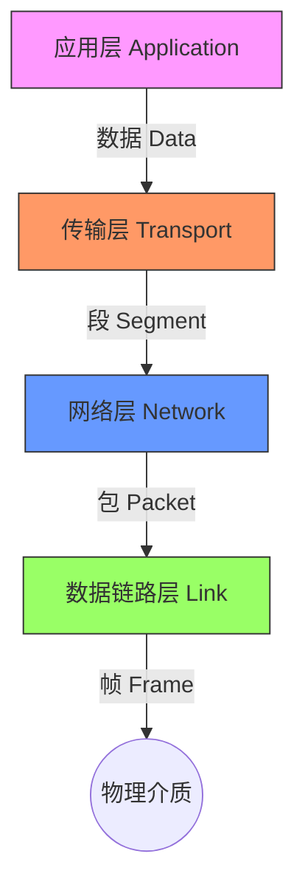
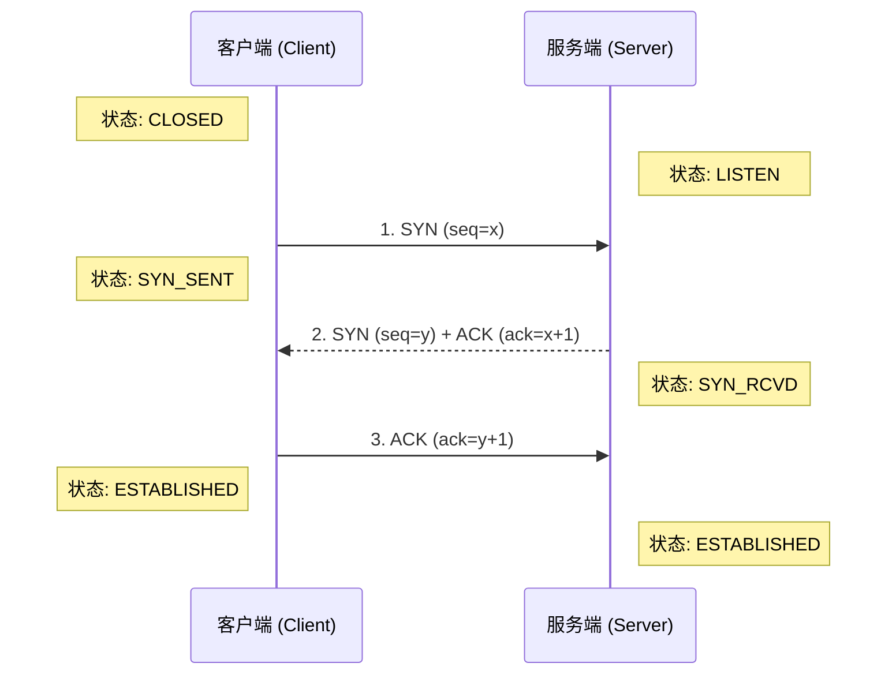

## 0. 核心图景：数据的快递系统

计算机网络本质上是一个精密的物流系统。当你在浏览器输入一个网址，就像是寄出了一个包裹。

为了确保包裹能跨越山海准确送达，网络被分成了不同的 " 层级 "，每一层只负责处理包裹的一个特定方面。这就是著名的 **TCP/IP 模型**。



---

## 1. TCP/IP 四层模型详解

相较于学术性的 OSI 七层模型，工业界通用的是更务实的 TCP/IP 四层模型。

| 层级 | 核心作用 | 现实类比 | 常见协议 |
| :--- | :--- | :--- | :--- |
| **应用层** | **决定内容**：规定应用程序如何格式化数据 | 写的信件内容（中文/英文，格式） | HTTP, DNS, FTP, SMTP |
| **传输层** | **负责可靠性**：端到端的连接，保证数据不丢、不乱 | 快递公司（顺丰/邮政），负责核对签收 | **TCP**, **UDP** |
| **网络层** | **负责寻址**：在茫茫网络中找到最佳路径 | 导航系统（GPS），规划路线 | **IP**, ICMP (Ping) |
| **链路层** | **负责硬件传输**：两个直连设备间的数据发送 | 运货卡车/光纤电缆 | ARP, Ethernet (MAC) |

---

## 2. 核心协议：TCP 与 UDP

传输层最著名的两个协议，也是面试和开发中的重中之重。

### 对比分析

| 特性 | TCP (Transmission Control Protocol) | UDP (User Datagram Protocol) |
| :--- | :--- | :--- |
| **连接性** | **面向连接** (打电话，先接通再说话) | **无连接** (寄明信片，写完直接丢邮筒) |
| **可靠性** | **高** (丢包重传，按序到达) | **低** (丢了不管，不保证顺序) |
| **速度** | 较慢 (握手、确认机制消耗资源) | 极快 (头部开销小) |
| **场景** | 网页 (HTTP)、文件下载、邮件 | 视频直播、即时语音、竞技游戏 |

### 代码视角：Socket 编程差异

使用 Python 模拟两种协议的发送方式，感受差异：

```python
import socket

# TCP 客户端：繁琐但稳健
def tcp_client():
    # 1. 建立连接 (打电话)
    s = socket.socket(socket.AF_INET, socket.SOCK_STREAM)
    s.connect(('127.0.0.1', 8080)) 
    # 2. 发送数据
    s.send(b'Hello TCP')
    # 3. 必须关闭
    s.close()

# UDP 客户端：简单粗暴
def udp_client():
    # 1. 不需要建立连接
    s = socket.socket(socket.AF_INET, socket.SOCK_DGRAM)
    # 2. 直接发射 (目标地址写在 sendto 里)
    s.sendto(b'Hello UDP', ('127.0.0.1', 9999))
```

---

## 3. TCP 的三次握手 (The Handshake)

TCP 为什么可靠？因为它建立连接非常谨慎。

**场景**：A 想给 B 打电话。

1. **SYN**: A 说 " 喂？听得到吗？"（我想建立连接）
2. **SYN-ACK**: B 说 " 听到了，你听得到我吗？"（确认 A 的请求，并请求 A 的确认）
3. **ACK**: A 说 " 听到了，那我们开始聊吧。"（连接建立）



> **为什么不是两次？**
> 防止已失效的连接请求突然又传到了服务端，导致服务端一直傻等客户端发数据，浪费资源。

---

## 4. 关键基础设施：DNS 与 IP

如果说 IP 地址是经纬度（如 `192.168.1.1`），那么域名（如 `google.com`）就是地名。

### DNS (Domain Name System)

互联网的**电话簿**。人类记不住 IP 数字，所以需要 DNS 将 `www.baidu.com` 解析为 `110.242.68.3`。

### ARP (Address Resolution Protocol)

**最后一公里导航**。
- **IP 协议**负责把你带到目标局域网。
- **ARP 协议**负责将 IP 地址转换为物理机器的 **MAC 地址**（网卡的身份证号）。

---

## 5. 经典面试题：输入 URL 后发生了什么？

这是一个串联所有知识点的原子化流程：

1. **DNS 解析**：浏览器查缓存 -> 查 Host 文件 -> 问 DNS 服务器 -> 得到目标 IP。
2. **建立 TCP 连接**：浏览器向目标 IP 发起三次握手。
3. **发送 HTTP 请求**：握手成功后，发送 `GET /index.html` 报文。
4. **服务器处理**：Nginx/Tomcat 收到请求，处理业务，返回 HTTP 响应。
5. **断开 TCP 连接**：通常是四次挥手（除非 Keep-Alive）。
6. **浏览器渲染**：解析 HTML -> 构建 DOM 树 -> 加载 CSS/JS -> 绘制页面。

---

## 6. 数据包的 " 套娃 " 结构

在网线上传输的二进制流，实际上是被层层包裹的。这也是 Wireshark 抓包时看到的结构。

$$
 \text{最终数据帧} = \underbrace{\text{Ethernet头} + \underbrace{\text{IP头} + \underbrace{\text{TCP头} + \underbrace{\text{用户数据(HTTP)}}_{\text{应用层}}}_{\text{传输层}}}_{\text{网络层}}}_{\text{链路层}} 
$$

- **Ethernet 头**：包含源 MAC 和目标 MAC。
- **IP 头**：包含源 IP 和目标 IP。
- **TCP 头**：包含源端口和目标端口（区分是发给 Web 服务还是 QQ）。

返回 [计算机基础能力](../30_Maps/计算机基础能力.md)
