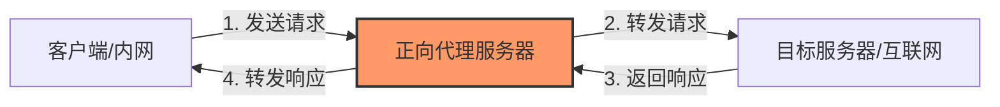
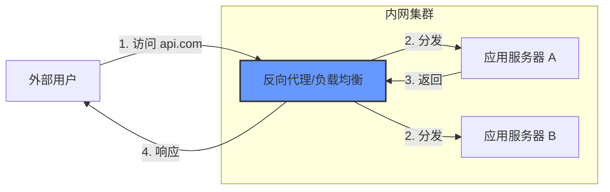

## 0. 核心定义与区别

在网络架构中，防火墙与代理服务器均位于通信链路的中间环节，但其功能定位具有本质区别：

- **防火墙 (Firewall)**：侧重于**访问控制**。基于预设的安全规则（IP、端口、协议），决定数据包是 " 通过 " 还是 " 丢弃 "。
- **代理 (Proxy)**：侧重于**数据转发**。充当中介角色，接收客户端或服务端的请求并代为发送，实现隔离、缓存或负载均衡。

---

## 1. 防火墙机制

防火墙通常部署在网络边界，用于隔离不同安全级别的网络（如公网与内网）。

### 核心策略

1. **入站规则 (Inbound)**：控制外部对内部的访问请求（默认通常设为拒绝）。
2. **出站规则 (Outbound)**：控制内部对外部的访问请求（防止服务器被入侵后外泄数据）。

### 场景：服务器端口加固 (UFW)

在 Linux 生产环境中，通常只开放必要的服务端口。

```bash
# 1. 默认拒绝所有入站流量，允许所有出站流量
sudo ufw default deny incoming
sudo ufw default allow outgoing

# 2. 允许 SSH 连接 (管理用)
sudo ufw allow 22/tcp

# 3. 允许 Web 服务 (业务用)
sudo ufw allow 80/tcp
sudo ufw allow 443/tcp

# 4. 启用防火墙
sudo ufw enable
```

---

## 2. 正向代理 (Forward Proxy)

**服务对象：客户端 (Client)**

正向代理位于客户端与目标服务器之间。客户端为了访问目标服务器，将请求发送给代理，由代理转发给目标。

### 核心特征

- **隐藏客户端**：目标服务器只记录代理服务器的 IP，无法直接识别真实客户端。
- **配置位置**：需要在客户端（浏览器或系统网络设置）进行配置。

### 典型场景

1. **访问控制**：企业内网限制员工只能通过特定的代理网关访问外部互联网。
2. **身份匿名**：隐藏请求来源 IP。



---

## 3. 反向代理 (Reverse Proxy)

**服务对象：服务端 (Server)**

反向代理位于互联网与内部服务器集群之间。客户端直接访问反向代理地址，反向代理根据策略将请求分发给后端的真实服务器。

### 核心特征

- **隐藏服务端**：客户端只知道反向代理的 IP，不知道后端具体有多少台服务器。
- **配置位置**：在服务端（如 Nginx, HAProxy）配置，客户端无感知。

### 典型场景

1. **负载均衡**：将流量轮询分发到多台应用服务器。
2. **SSL 卸载**：由反向代理统一处理 HTTPS 加密解密，减轻业务服务器负担。
3. **安全隔离**：业务服务器部署在内网，不暴露公网 IP，仅通过反向代理暴露服务。



---

## 4. 正向代理与反向代理对比

| 维度 | 正向代理 (Forward Proxy) | 反向代理 (Reverse Proxy) |
| :--- | :--- | :--- |
| **代理对象** | **客户端** | **服务端** |
| **隐匿方** | 隐藏了客户端 | 隐藏了服务端 |
| **配置端** | 客户端配置 | 服务端配置 |
| **主要用途** | 突破访问限制、审计、匿名 | 负载均衡、安全防护、缓存加速 |

---

## 5. Nginx 反向代理配置示例

在实际开发中，最常使用的是通过 Nginx 配置反向代理，将 80 端口流量转发至后端应用（如 Node.js 或 Python 服务）。

```nginx
server {
    listen 80;
    server_name api.example.com;

    location / {
        # 1. 代理转发目标
        proxy_pass http://127.0.0.1:3000;

        # 2. 传递客户端真实 IP
        # 若不设置，后端获取到的 IP 将永远是 127.0.0.1
        proxy_set_header Host $host;
        proxy_set_header X-Real-IP $remote_addr;
        proxy_set_header X-Forwarded-For $proxy_add_x_forwarded_for;
    }
}
```

## 6. 综合架构视图

在成熟的互联网架构中，代理与防火墙通常是协同工作的：

$$
 \text{用户} \xrightarrow{\text{正向代理}} \text{互联网} \xrightarrow{\text{防火墙}} \xrightarrow{\text{反向代理}} \xrightarrow{\text{业务集群}} 
$$

1. **用户侧**：可能经过正向代理（如公司网关）发出请求。
2. **边界侧**：请求到达数据中心，硬件防火墙清洗恶意流量。
3. **接入侧**：反向代理（LVS/Nginx）接收合法流量并分发。
4. **应用侧**：业务服务器处理逻辑。

返回 [计算机基础能力](../30_Maps/计算机基础能力.md)
