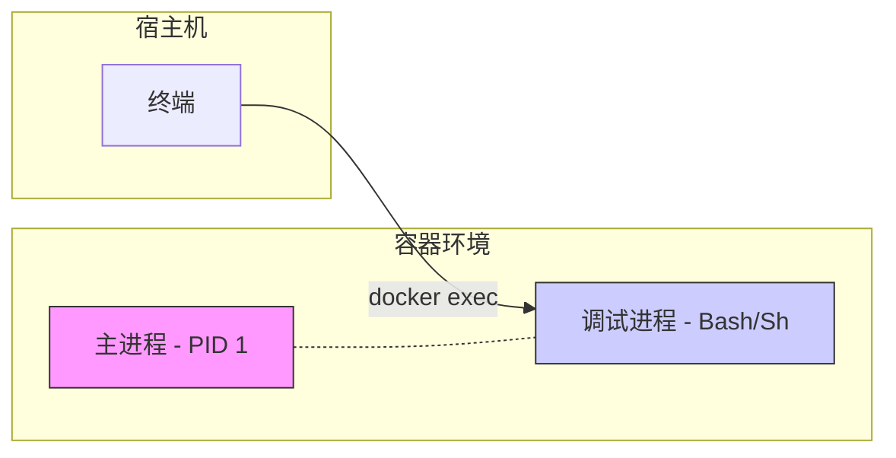

## 0. 机制

容器虽然被设计为 [不可变基础设施](../10_Notes/不可变基础设施.md)，但在开发或排查故障时，我们经常需要像 SSH 登录远程服务器一样进入容器内部。

**关键区别**：
- **SSH**：通常连接到宿主机或虚拟机。
- **docker exec**：在已运行的容器内**启动一个新的进程**（通常是 Shell），这个新进程与主进程（如 Nginx）并存，互不干扰。



---

## 1. Shell 交互式进入

这是最高频的操作，用于获得一个完整的命令行环境。

**标准命令格式**：

```bash
# -i (Interactive): 保持标准输入开启
# -t (TTY): 分配一个伪终端
docker exec -it [容器名称/ID] [Shell类型]
```

### 场景 A：进入标准容器 (Ubuntu/Debian/CentOS)

大多数全功能镜像包含 `bash`。

```bash
# 以 root 身份进入 my-app 容器
docker exec -it my-app bash

# 此时提示符变为：root@a1b2c3d:/#
# 可以执行 ls, top, ps 等命令
```

### 场景 B：进入精简容器 (Alpine)

很多现代镜像（如 Node.js, Go 的 Alpine 版本）为了减小体积，**没有安装 bash**，只能使用 `sh`。如果你尝试 bash 报错 `executable file not found`，请切换为 sh。

```bash
docker exec -it my-app sh
```

### 场景 C：以特定用户身份进入

某些数据库或服务容器不允许 root 直接操作，需要切换用户。

```bash
# 以 mysql 用户身份进入，直接操作数据库文件
docker exec -it -u mysql my-db bash
```

---

## 2. 单次命令执行

并不总是需要进入容器。如果你只想查看某个配置文件的内容，或者检查网络，可以直接在外部执行内部命令。

**场景**：确认 Nginx 配置文件内容是否正确。

```bash
# 直接在宿主机终端看到容器内文件的内容
docker exec -it my-nginx cat /etc/nginx/nginx.conf
```

**场景**：手动触发 Laravel/Django 的后台任务。

```bash
# 在容器内运行 php artisan 命令，跑完即退
docker exec -it my-php-app php artisan migrate
```

---

## 3. 常见痛点与解决方案

在容器内调试时，最常遇到的尴尬是：**没有编辑器**。

- 想改配置文件，发现 `vi`, `vim`, `nano` 统统没有安装。
- `apt-get install vim` 又太慢或报错。

**解决方案**：使用 `docker cp` 进行 " 场外援助 "。

1. **复制出**：把容器内文件复制到宿主机。
2. **修改**：用宿主机的 VS Code 或 Vim 修改。
3. **复制回**：把改好的文件覆盖回容器。

```bash
# 1. 把 nginx.conf 拷贝到当前目录
docker cp my-nginx:/etc/nginx/nginx.conf ./nginx.conf

# … (在本地修改文件) …

# 2. 把修改后的文件拷回容器
docker cp ./nginx.conf my-nginx:/etc/nginx/nginx.conf

# 3. 重载配置
docker exec my-nginx nginx -s reload
```

---

## 4. 易混淆概念：exec vs attach

新手容易混淆这两个命令，建议**始终使用 exec**。

| 特性 | docker exec (推荐) | docker attach (慎用) |
| :--- | :--- | :--- |
| **原理** | 创建一个新的进程（侧边车） | 连接到容器的主进程（PID 1） |
| **独立性** | 退出调试不影响主服务 | **极易导致容器停止** |
| **退出方式** | 输入 `exit` 仅关闭 Shell | 按 `Ctrl+C` 会直接杀掉容器主进程 |
| **适用场景** | 调试、探查、修改文件 | 查看交互式应用的实时输出 |

**警示**：如果不小心用 `attach` 进入了容器，想要退出但不想停止容器，需要按下组合键 `Ctrl+P` 然后 `Ctrl+Q`（Detach），千万别按 `Ctrl+C`。
