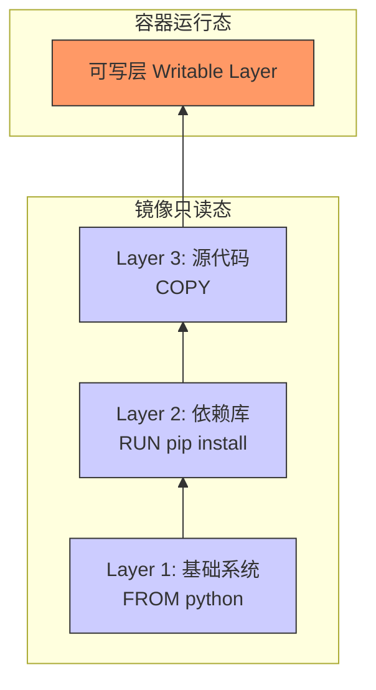
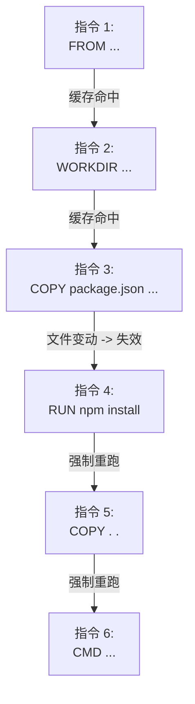

## 0. 原理

Docker 镜像并非一个单一的巨大文件，而是由一组 **只读层** 像千层饼一样堆叠而成的。

这种机制被称为 **联合文件系统 (UnionFS)**。

- **镜像层**：Dockerfile 中的每一条指令（如 `FROM`, `RUN`, `COPY`）都会生成一个新的层。
- **容器层**：当你启动容器时，Docker 会在最顶部加一层薄薄的**可写层**。所有对文件的修改都发生在这里，而不会影响底下的镜像层（Copy-on-Write 机制）。



---

## 1. 缓存失效逻辑

构建速度优化的核心在于**利用缓存**。Docker 构建时会自上而下检查每一层：

1. **指令检查**：指令内容变了吗？
2. **文件检查**：`COPY/ADD` 的文件内容（Checksum）变了吗？

**多米诺骨牌效应**：
一旦某一层缓存失效（Cache Miss），**它之后的所有层**缓存都会立即失效，必须重新执行。



---

## 2. 优化策略：依赖分离

这是开发中最常见、收益最高的优化技巧，特别适用于 Node.js, Python, Go 等项目。

**错误写法**：每次修改代码，哪怕只改了一行注释，都会导致 `COPY . .` 层的指纹变化，进而导致后面的 `npm install` 重新下载几百 MB 的依赖包。

```dockerfile
# 糟糕的写法
WORKDIR /app
COPY . .                  # 代码一变，缓存失效
RUN npm install           # 被迫重新下载依赖 (耗时)
CMD ["node", "app.js"]
```

**正确写法**：利用分层机制，将**变化频率低**的依赖文件（package.json）和**变化频率高**的源代码分开处理。

```dockerfile
# 推荐的写法
WORKDIR /app

# 1. 先只复制依赖描述文件
COPY package.json package-lock.json ./

# 2. 安装依赖 (只要 package.json 没变，这层直接用缓存，秒过)
RUN npm install

# 3. 最后再复制源代码
COPY . .

CMD ["node", "app.js"]
```

---

## 3. 优化策略：层级合并

每一个 `RUN` 指令都会新建一层。如果不合并指令，会导致镜像臃肿，甚至出现删不掉文件的尴尬。

**场景**：下载一个压缩包，解压，然后删除压缩包。

**错误写法**：

```dockerfile
RUN wget http://example.com/big-file.tar.gz  # Layer A: 100MB
RUN tar -xvf big-file.tar.gz                 # Layer B: 解压后 100MB
RUN rm big-file.tar.gz                       # Layer C: 标记删除，但 Layer A 的 100MB 依然占用物理空间
```

*结果*：镜像体积 = 100MB + 100MB = 200MB。

**正确写法**：使用 `&&` 连接命令，确保在**同一层**内完成 " 下载 - 解压 - 清理 "。

```dockerfile
RUN wget http://example.com/big-file.tar.gz \
    && tar -xvf big-file.tar.gz \
    && rm big-file.tar.gz
```

*结果*：镜像体积 = 100MB（只有解压后的文件被提交到了层中）。

---

## 4. 优化策略：变动最小化

编写 Dockerfile 时，遵循 "**越稳定的越靠前，越易变的越靠后**" 的原则。

| 类别 | 变化频率 | 建议位置 | 示例 |
| :--- | :--- | :--- | :--- |
| **基础系统** | 极低 | 顶部 | `FROM ubuntu`, `RUN apt-get update` |
| **系统库** | 低 | 上部 | `RUN apt-get install git nginx` |
| **项目依赖** | 中 | 中部 | `RUN pip install -r requirements.txt` |
| **环境变量** | 中 | 中下部 | `ENV PORT=8080` |
| **源代码** | 极高 | 底部 | `COPY . .` |

---

## 5. 验证与查看

如何确认优化是否生效？

### 查看构建日志

构建时观察输出信息：

- `---> Using cache`：恭喜，利用了缓存。
- `---> Running in …`：缓存未命中，正在重新执行。

### 查看镜像历史

使用 `docker history` 命令可以清晰地看到每一层的大小和创建命令，是排查大镜像的好方法。

```bash
# 查看镜像的分层详情
docker history my-app:latest

# 输出示例 (从下往上):
# IMAGE          CREATED        CREATED BY                                      SIZE
# <missing>      1 minute ago   CMD ["node" "app.js"]                           0B
# <missing>      1 minute ago   COPY . .                                        2.5KB  <-- 代码层
# <missing>      2 days ago     RUN npm install                                 150MB  <-- 依赖层
# <missing>      2 weeks ago    COPY package.json ...                           500B
```
