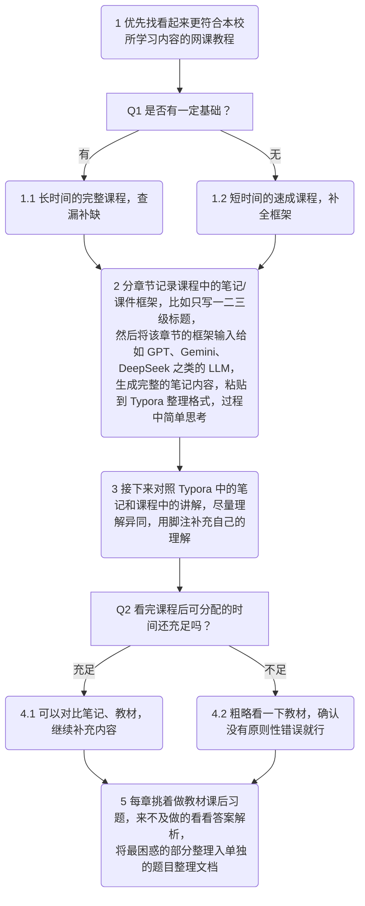

## 2025.12.11

### 上午

依旧 10 点醒来，在床上玩手机到 10 点 20 分，下床准备前往 A4 教学楼上中级财务会计。其实这门课除了第一节课点过一次名就再也没点过名，按照概率来说点名的概率小得可怜，但是如果考虑到老一辈有始有终的信念熏陶的情况，这最后一节课还是不要心存侥幸为妙。

上课前老师以口齿不清、时大时小的声音讲了讲期末考试的题型，然而实在难以辨认其密码暗文，只能依稀听出来多选题选错少选多选都不得分这种神秘的规则。不过猜也能猜到题型会是些什么，无外乎单选多选、判断简答、计算制表等等。对我来说关注题型反而应该是后话，毕竟我的基础知识水平还停留在大一速成的会计知识水平，也许只有先复习（或者说预习）完全部课程重点才有资格挑战。

然后老师继续对着教材目录讲了一些重点划分，再之后是答疑时间。实际上大家也都不怎么有疑问，于是接下来的时间都在干自己的事情。下课前在美团上 30 元子点了一份必胜客的四件套，遥想小时候还觉得必胜客是一种很高端的餐厅，各种食物都挺贵的，现在果然是消费降级的时代了吗。

### 下午

下午复习备考最早考试的成本会计科目。要弥补我这一个学期只上了两三节课的孱弱的成本会计知识，不可谓不需要付出一些功夫。经过我三个学期以来速成期末的经验，我总结出了一套也许成熟度较高、可复现性较强的方法论，下面以流程图形式呈现：

下午大概已经将成本会计九章里的四章推进到了第三步的结束，计划是周六结束之前将九章全部推进到第三步结束，隔一天之后用两天完成剩下的步骤，16 号结束，18 号考试。

### 晚上

开始的时候还是在好好复习，中途舍友不经意提到云鲤 [^1] 有半价活动。遇到此种特殊情况也不在意是否真的比外卖点奶茶更便宜了，心血来潮立马叫上高中舍友陈梓熙前往探寻。点了一杯橙子柠檬茶，两种柑橘类的果片泡出来的味道其实还挺相似的，味道没有什么很独特的点，价格也是普普通通的 7 元子。但毕竟是复习途中突然休息所购入的饮料，心情愉悦并且因此觉得挺好喝也是很正常的。

在走回宿舍的途中得知外卖到了，实在是不错的 timing，正好顺路去取外卖了。在路上见到一个长得像喜多川海梦的人，不知道是不是 coser，但陈梓熙一直在低头研究碧蓝航线最新出的一个无法手动改位置、无法手动选定攻击目标、无法手动释放技能的三无 PVP 新模式，直到走过去一分钟我才提醒他，他方觉天地狭窄。

拿到外卖回宿舍美美享用，虽然是很普通的烧腊品类，但能做好菜量和品质的均衡也是一件很难的事情。之前看小红书（非广告或推广）评论区推荐而点的湛江白切鸡就是虽然质量尚可，但菜量实在难以满足，为此我还一度陷入了对小红书推荐的怀疑中。这次挑选了一家之前从未点过的、推荐页在很下面应该没给平台什么推广费的、菜单设计很质朴的港式烧腊店，本来只是抱着尝鲜的想法，但实际收到发现居然总体很不错，性价比也颇高，唯一可惜的就是包装有点简陋，也许天气再冷点就无法点他家的外卖了。

记住这家店的名字：心妍港式烧腊。

吃完想着继续复习，但是吃完饭脸有点油所以不太想戴眼镜所以看不清电脑屏幕，自然也就无法继续学习，于是自然开始看手机。此为自然之理，无法避免。由于上述所说的烧腊的店名和小学时一个关系比较好的同学有重复的字，想着看看有没有因为许久没有联系而被她删掉，就点开 QQ 想通过诸如看状态、试图转账一类的隐蔽方法试探，最终得出的结论是并没有被删除、很可能只是她这个号不用了而已。但因此突然进入了对其它老同学的好奇之中，因为没有黄钻删除访客记录的能力贸然点开空间有点奇怪，就退而求其次开始翻看他们的历史个性签名。不得不说确实很有意思，此处节选一些，不显露名字，以防万一本日记泄露侵犯隐私：

1. 我虽无意逐鹿，却知苍生苦楚
2. 天地万物，唯我独尊
3. 第六次生物大灭绝即将开始
4. 我想鲨掉处于平行宇宙的那个我
5. 我命由我，干嘛要由天
6. 一个人在你身边时，可能会不禁地落泪

发到锐刻群 [^2] 之后果然掀起一阵复古浪潮。唉，我果然是识贯古今、悲悯世人的正义史官。

再之后刷贴吧偶然发现一张不知出处不知人物的男友视角侧躺图片，依旧转发到锐刻群，也是获得了极大好评，并在众人强烈要求下开始了漫漫互联网搜索之路。开始的时候想着使用 yandex 的图片搜索功能，结果发现只能搜到一些保存有该图片的写真或黄色网站，并没有标注真实出处，不久甚至发现该功能 " 正在建设中 "，应该是梯子崩掉了？但与我一同开始寻找真相的玉帝 [^3] 也发现该功能 " 正在建设中 "，看来是确有此事。接下来就寻找各种识图网站，最终在谷歌的 imghp 识图搜人的帮助下扫到了重合度较高的关键账号信息：auddk_77，此人 ins 主页显而易见是一个韩国擦边女主播，但我仍不完全相信人物匹配，于是开始翻找其 ins 主页，最终在将账号信息透露给锐刻的 1 分钟之内，原图原帖就被日本 [^4] 找到了，至此此事圆满终结。但是发现这样一张清纯可爱的图片的主人居然是一个擦边女主播，不免觉得这个世界确实有点难以言喻。虽说其他形式的剥削和异化也总是存在，而且往往比之此种兜售美貌与性幻想的商品形式更残酷严峻，但此种现象确实在这一刻为我带来了一定的心理冲击，也不免为这个不可挽回地堕落到充满浮躁、欲望和快速变现的世界感到不安。

但换个角度来说，这张照片确由擦边女主播本人发布倒也是一件好事。毕竟如果是货真价实的素人，那这张照片背后的故事可能是偷拍泄露、分手报复乃至卖淫之类的黑暗经历了。

[^1]: 算是华南理工大学的奶茶品牌吧，此处指大学城校区麦当劳楼下、瑞幸咖啡旁边的奶茶店。
[^2]: 虽然应该会一直记得，但还是提示一下以后的我，这是高一玩的比较好的几个同学组的微信群。
[^3]: 本名张廷玉，并非真实玉皇大帝，也并非清朝官员。
[^4]: 本名张卓然，并非真实日本人，也并非中日混血，不知道是不是精神日本人。
