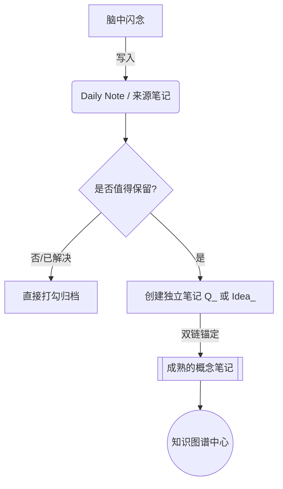

# 问题与灵感管理规范

> [!warning] 核心风险
> 并不是每一个想法都值得成为一个文件。为了防止图谱爆炸，必须严格执行**" 记录 -> 筛选 -> 升级 "**的三级流程。

## 1. 第一级：快速捕获

**场景**：学习过程中突然产生的疑惑，或者走路时蹦出的点子。
**动作**：**不要创建新文件！** 直接写入当天的 **Daily Note** 或当前正在阅读的主题笔记末尾。

**写入格式（使用 Task 列表）：**
- `- [ ] ❓ Question: 为什么 Linter 会和 Templates 冲突？`
- `- [ ] 💡 Idea: 可以把 Obsidian 的图谱想象成大脑的神经元，孤立的神经元会死亡。`

**为什么这样做？**
- **低阻力**：不打断心流。
- **防污染**：很多临时疑问在半小时后就解决了，不配进入永久知识库。

---

## 2. 第二级：筛选与升级

**场景**：当天的回顾环节，或者发现某个问题非常深刻，需要长久保存。
**动作**：将这个 List 条目提取为一个独立的原子笔记。

### 2.1 命名规范

为了在文件列表中一眼识别出哪些是 " 坑 " 哪些是 " 砖 "，建议加前缀：

- **问题类**：`Q_一句话描述问题.md` (例如: `Q_Linter与Templates冲突的本质原因.md`)
- **灵感类**：`Idea_一句话描述点子.md` (例如: `Idea_Obsidian图谱的神经元隐喻.md`)

### 2.2 专用模板

在 `99_System/Templates` 下创建 `问题灵感模板.md`：

```markdown
---
created: {{date}} {{time}}
tags:
  - #type/question  (或 #type/idea)
  - #status/unsolved (或 #status/processed)
---

# {{title}}

## 1. 触发场景 (Context)
我是在看 [[什么书或文章]] 时想到的？
或者当时我在解决 [[什么项目]]？

## 2. 核心内容 (Content)
详细描述这个问题或灵感。

## 3. 关联知识 (Connections)
- 属于哪个大概念？ [[核心概念]]
- 反驳了哪个观点？ [[相关笔记]]

## 4. 行动/答案 (Action/Answer)
- [ ] 待查证资料…
- [ ] 待实验…
```

---

## 3. 第三级：防止图谱混乱

### 3.1 锚定原则

**任何一个 `Q_` 或 `Idea_` 笔记，必须至少链接到一个已存在的实体概念笔记。**
- ❌ 错误：创建一个 `Idea_从苹果掉落想到的.md`，孤零零地放在库里。
- ✅ 正确：在 `Idea_从苹果掉落想到的.md` 里，写上 `关联概念：[[万有引力]]`。
- **效果**：这样你的灵感就会像卫星一样，围绕着 " 万有引力 " 这个行星旋转，图谱结构依然清晰。

### 3.2 完结即合并

如果一个 **Question** 已经被完美解决了，并且答案非常经典：

1. **策略 A（推荐）**：保留该文件，改名为陈述句（去掉 `Q_`），把 Tag 改为 `#status/evergreen`，作为永久知识。
2. **策略 B（极简）**：把答案的内容合并到它依附的主题笔记中，然后**删除**这个 `Q_` 文件。

### 3.3 视觉降噪

在 Obsidian 的关系图谱设置中，学会 " 眼不见为净 "：

- **过滤设置**：
	- `Filters` -> `Files` -> 输入 `-file:Q_` (减号表示排除)。
	- 或者排除 Tag：`-tag:#type/question`。
- **用途**：当需要检视宏观知识架构时，把这些细碎的问题点子屏蔽掉；当需要寻找灵感时，再把它们放出来。

---

## 4. 总结：工作流示意图



### 补充建议

1. **" 混乱 " 的辩证看法**：
	- 在知识库的早期，混乱是必然的。不要过早优化。
	- **局部混乱是好事**：如果图谱中某个区域密密麻麻全是线，说明在这里思考最深。
	- **全局离散是坏事**：如果图谱全是孤立的点，说明没有做 " 双链锚定 "。

2. **关于 " 提取 " 操作的小技巧**：
	- Obsidian 有一个核心插件叫 **Note composer**。
	- 在 Daily Note 里选中那段文字 -> 右键 -> `Extract current selection` -> 输入新文件名。
	- 它会自动把文字搬运到新文件，并在原位置留下一个双向链接 `[[新文件名]]`。这能完美保持上下文关系！
